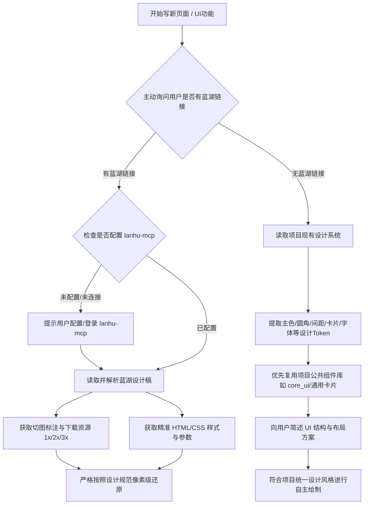

# UI 设计源决策、蓝湖 MCP 接入与切图资源规范（assets）

## 1. UI 设计源决策闭环（UI-First SOP）

在开始编写任何新页面/新功能 UI 之前，AI 必须严格执行 **「先问设计源 ➔ 分支处理 ➔ 像素级对齐/符合项目规范」** 的流程，严禁未经询问直接盲目手写 UI。



### 💬 启动阶段标准询问话术（AI 必问）
> “在开始编写新页面前，请问是否有该页面的**蓝湖设计稿链接**？
> - **如果有**：请把蓝湖链接提供给我，我将通过 `lanhu-mcp` 自动读取精准样式参数（颜色、尺寸、间距、圆角等）并提取切图资源；
> - **如果没有**：我将参考项目现有的整体 UI 规范（主题色系、圆角卡片、`.sc` 间距、`core_ui` 公共组件）为您自主设计并绘制符合项目风格的页面。”

---

## 2. 分支 A：有蓝湖链接（设计稿驱动模式）

### 步骤一：检查 `lanhu-mcp` 状态
1. 检查当前环境是否已配置并连接 `lanhu` MCP Server（包含 `lanhu_get_designs`、`lanhu_get_ai_analyze_design_result`、`lanhu_get_design_slices` 等工具）。
2. 若未配置或无法调用，立即提示用户配置/开启 `lanhu-mcp`，或引导用户粘贴具体设计参数/切图。

### 步骤二：读取并解析设计稿（精准样式）
1. 调用 `lanhu_get_designs` 匹配对应页面的 `image_id` 或页面名称。
2. 调用 `lanhu_get_ai_analyze_design_result` 获取精准设计规格：
   - **最高权威性**：返回的 HTML/CSS 规格参数（包括 `rgba()` 色值、`padding/margin` 间距、`fontSize/fontWeight`、`borderRadius`、`linear-gradient` 等）是唯一的真实设计标准；
   - **严格映射**：直接将 CSS 参数转换为 Flutter 等效属性（如 `Color.fromRGBO(...)`、`EdgeInsets`、`15.sc`），**严禁擅自四舍五入或随意简化数值**；
   - **预览图仅供校验**：设计图仅作为视觉辅助对齐，不得覆盖精确的 CSS 参数。

### 步骤三：提取切图资源（杜绝系统 Icon 脑补）
1. 调用 `lanhu_get_design_slices` 获取该页面下的所有切图。
2. **严禁行为**：凡设计稿中的图标、插画、装饰、按钮图标，**严禁私自使用 `Icons.xxx` 或 `CupertinoIcons.xxx` 替代**。
3. 确认切图倍率（Web 1x/2x/3x 或 iOS @1x/@2x/@3x），并按本规范落盘至对应 Feature 包的 `assets/images/` 目录中。

---

## 3. 分支 B：无蓝湖链接（项目设计规范自适应模式）

当用户确认没有蓝湖链接时，UI 绘制必须遵循本项目的统一设计语言与现存模式：

### ① 提取项目既有 Design Tokens
- **颜色体系**：
  - 页面主背景色：`#F5F6F8`（或项目中既定的灰底卡片背景）；
  - 主题主色：品牌主色（橙色/主强调色）；
  - 文字色彩梯度：主标题色（深黑/高对比）、副标题/正文色（次级深灰）、提示/弱化色（浅灰）；
  - 分割线/边框色：项目通用的浅灰分割线。
- **尺寸与间距网格**：
  - 所有尺寸必须添加 `.sc` 屏幕适配扩展（如 `16.sc`、`24.sc`）；
  - 间距遵循项目标准梯度（如 `4.sc` / `8.sc` / `12.sc` / `16.sc` / `24.sc`），避免随意的奇数大边距。
- **卡片与圆角**：
  - 内容块必须收敛在白色圆角卡片中（常见圆角 `8.sc` 或 `12.sc`，背景为白色 `Colors.white`，外带微弱阴影或浅边框）。

### ② 优先复用公共组件（`core_ui` & Feature 公共组件）
- 顶部导航栏：统一使用 `CommonAppBar` / 标准顶栏；
- 按钮：统一使用项目主按钮/次按钮样式（圆角主色实心按钮、白底描边按钮）；
- 列表项：统一使用标准 Row 布局（左侧图标/标题 + 中间内容 + 右侧箭头 `ic_arrow_right` / 操作项）；
- 空状态/加载态：统一使用项目标准的 Loading 与 EmptyWidget。

### ③ 布局结构确认（对齐后再写）
- 简述页面结构（如：“页面由 3 部分构成：顶部用户信息概览卡片 + 中间快捷功能网格 + 底部退出登录操作按钮”），获得用户首肯后进行组件化拆解与编码。

---

## 4. 资源落位与 Monorepo 目录结构

在 `tuqiang` monorepo 中，资源文件按作用域严格分层：

```text
tuqiang/
├── packages/
│   ├── feature/
│   │   └── feature_auth/                   # 业务模块包
│   │       ├── assets/
│   │       │   └── images/                 # 模块私有图片
│   │       │       ├── icon_phone.png      # 1.0x 基准图（设计稿标注逻辑尺寸，如 20x20）
│   │       │       ├── 2.0x/               # 2 倍图（40x40）
│   │       │       │   └── icon_phone.png
│   │       │       └── 3.0x/               # 3 倍图（60x60）
│   │       │           └── icon_phone.png
│   │       ├── lib/
│   │       │   ├── feature_auth.dart       # 对外 export
│   │       │   └── src/
│   │       │       └── assets/             # 资源常量类
│   │       │           └── feature_auth_assets.dart
│   │       └── pubspec.yaml                # 声明 assets
│   └── assets_common/                      # 跨端/跨模块公共静态资源
│       └── assets/
│           └── images/                     # 全局通用 Logo、隐私协议切图等
```

### 归属判定表
| 资源类型 | 存放位置 | 示例 |
|---|---|---|
| **Feature 专属业务图标/配图** | `packages/feature/feature_xxx/assets/images/` | 登录页背景、功能入口小图标、业务表单切图 |
| **跨模块公共切图** | `packages/assets_common/assets/images/` | 统一返回箭头、公司 Logo、通用弹窗插画 |
| **公共大文件/HTML/协议** | `packages/assets_common/assets/html/` | 隐私协议 HTML、用户协议文档 |

---

## 5. 多倍图（Asset Variants）与切图导出规范

Flutter 通过子目录自动识别屏幕像素密度（DPI/DPR）：

1. **目录层级与倍率关系**：
   ```text
   assets/images/
   ├── icon_service.png          # 1.0x 基准（设计稿 1x 标注逻辑点尺寸，如 24x24）
   ├── 2.0x/
   │   └── icon_service.png      # 2.0x 图（48x48，尺寸为 1x 的 2 倍）
   └── 3.0x/
       └── icon_service.png      # 3.0x 图（72x72，尺寸为 1x 的 3 倍）
   ```

2. **蓝湖切图平台选择（⚠️ 避坑红线）**：
   - **严禁选择 Android 模式导出**：Android 模式会按照 `mdpi/hdpi/xhdpi/xxhdpi/xxxhdpi` 导出，容易产生奇数小数像素且目录命名不兼容；
   - **正确选择【iOS】或【Web/通用】**：导出的 `@1x`、`@2x`、`@3x` 完美对应 Flutter 的 1.0x、2.0x、3.0x；
   - 将导出的切图分别放入主目录、`2.0x/` 与 `3.0x/`。

3. **切图尺寸规整与透明外框规范**：
   - **尺寸必须为偶数**：1x 基础切图尺寸必须为偶数（如 `16x16`、`20x20`、`24x24`、`32x32` 等），保证 2x、3x 能被整除，避免边缘抗锯齿发虚；
   - **统一透明外框（Bounding Box）**：同一列表中并列的图标，切图必须带上统一尺寸的透明外框（如统一 `24x24` 框），防止在 Flutter 页面中因图形微小尺寸差异导致排版抖动。

---

## 6. 命名规范（必须遵守）

- **全部小写字母 + 下划线（`snake_case`）**，**严禁使用中文、空格或大写驼峰**（避免 iOS/Android/鸿蒙跨端构建时文件名大小写敏感冲突）；
- **前缀语义化分类**：

| 前缀 | 用途 | 命名示例 |
|---|---|---|
| `icon_` 或 `ic_` | 小图标、操作入口图标 | `icon_phone_contact.png`、`ic_arrow_right.png` |
| `img_` | 插画、大配图、占位图 | `img_empty_search.png`、`img_banner_default.png` |
| `bg_` | 背景图、卡片底图 | `bg_login_header.png`、`bg_card_gradient.png` |
| `btn_` | 按钮切图、点选状态 | `btn_radio_checked.png`、`btn_radio_normal.png` |

---

## 7. 代码注册与调用标准模板

### ① 在 `pubspec.yaml` 声明资源路径
```yaml
# packages/feature/feature_auth/pubspec.yaml
flutter:
  assets:
    - assets/images/
    - assets/images/2.0x/
    - assets/images/3.0x/
```

### ② 在 `src/assets/feature_xxx_assets.dart` 定义常量
禁止在 Widget 代码中硬编码字符串路径！

```dart
// packages/feature/feature_auth/lib/src/assets/feature_auth_assets.dart
class FeatureAuthAssets {
  FeatureAuthAssets._();

  static const String package = 'feature_auth';

  /// 电话联系图标
  static const String iconPhoneContact = 'assets/images/icon_phone_contact.png';

  /// 微信客服图标
  static const String iconWechat = 'assets/images/icon_wechat.png';

  /// 快捷构建 Image Widget（可选）
  static Image image(
    String name, {
    double? width,
    double? height,
    BoxFit? fit,
  }) {
    return Image.asset(
      name,
      package: package,
      width: width,
      height: height,
      fit: fit,
    );
  }
}
```

### ③ 在 `feature_xxx.dart` 中 export
```dart
// packages/feature/feature_auth/lib/feature_auth.dart
export 'src/assets/feature_auth_assets.dart';
```

### ④ 在 Widget 中调用
```dart
import 'package:flutter/material.dart';
import 'package:core_base/num_extension.dart';
import '../assets/feature_auth_assets.dart';

// 方式 A：直接使用 Image.asset（必须带 package 参数）
Image.asset(
  FeatureAuthAssets.iconPhoneContact,
  package: FeatureAuthAssets.package,
  width: 24.sc,
  height: 24.sc,
  fit: BoxFit.contain,
)

// 方式 B：使用常量类封装的快捷方法
FeatureAuthAssets.image(
  FeatureAuthAssets.iconPhoneContact,
  width: 24.sc,
  height: 24.sc,
)
```

> ⚠️ **高频踩坑注意**：
> 在多 package 架构下，`Image.asset` 若不传 `package: 'feature_xxx'`，Flutter 默认会去主入口 `apps/tuqiang_app` 查找资源，导致 **`Unable to load asset` 运行时图片丢失报错**！

---

## 8. 交付前切图与 UI 自检 Checklist

- [ ] 新建页面前已向用户明确询问是否有蓝湖设计稿；
- [ ] 有蓝湖稿时，已通过 `lanhu-mcp` 提取精确 CSS 样式与多倍切图，并严格执行像素级还原；
- [ ] 无蓝湖稿时，已严格契合项目现有的主题色、背景色、卡片圆角、`.sc` 网格及 `core_ui` 公共组件；
- [ ] UI 中的所有图标/配图均已使用切图，没有私自残留 `Icons.xxx`；
- [ ] 所有图片文件名使用英文小写下划线（`snake_case`）；
- [ ] 图片资源已放入 `assets/images/`（及 `2.0x/`、`3.0x/`）；
- [ ] 对应 package 的 `pubspec.yaml` 中已包含该 assets 路径；
- [ ] 已在 `feature_xxx_assets.dart` 定义常量并在 `feature_xxx.dart` 中 export；
- [ ] 调用处已显式指定 `package: 'feature_xxx'` 参数，且尺寸加上了 `.sc`。

